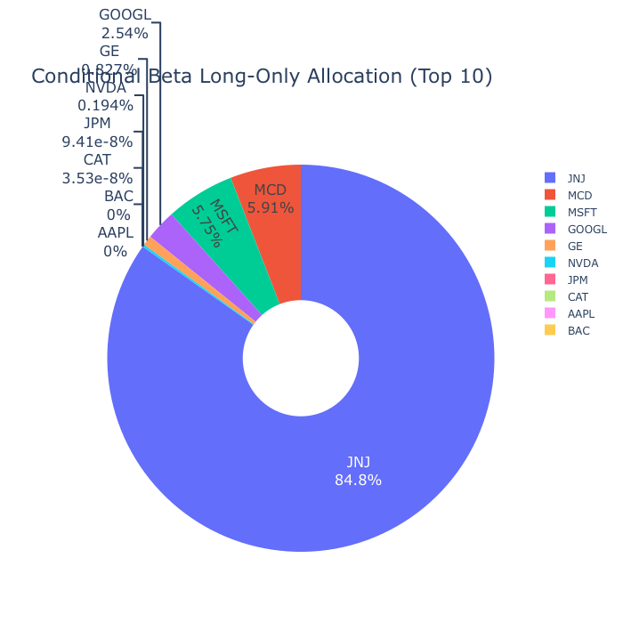
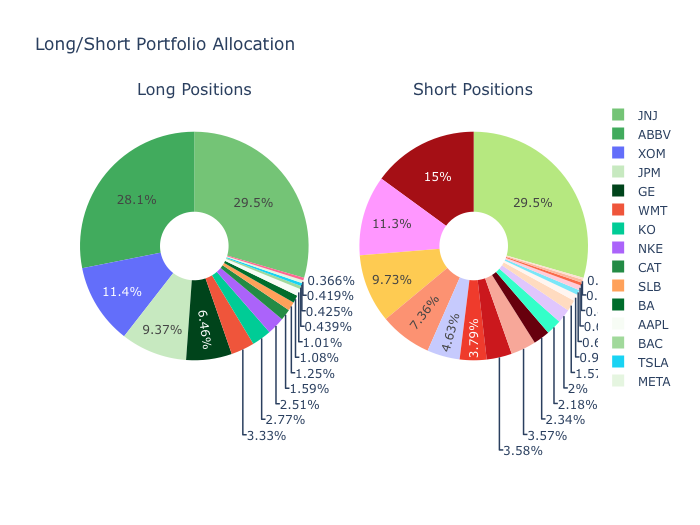
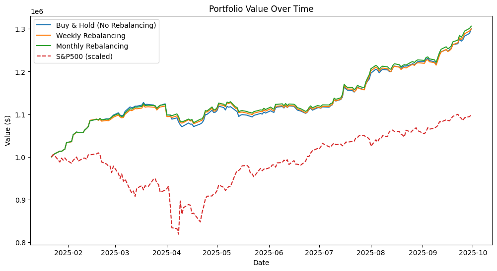

# Portfolio Optimization with Conditional and Standard Betas

This project implements and analyzes different portfolio optimization strategies using both **conditional betas** and **standard historical betas**. Three portfolio types are considered: **long-only**, **long/short**, and **high-leverage long/short**. The analysis focuses on **risk-adjusted performance, diversification, and market stability**, including quantitative backtests and portfolio tracking over a 2-year historical period.

---

## Table of Contents

1. [Project Overview](#project-overview)  
2. [Data](#data)  
3. [Methodology](#methodology)  
   - [Portfolio Types](#portfolio-types)  
   - [Conditional vs Standard Beta](#conditional-vs-standard-beta)  
   - [Portfolio Tracker](#portfolio-tracker)  
4. [Results](#results)  
   - [Long-Only Portfolio](#long-only-portfolio)  
   - [Long/Short Portfolio](#longshort-portfolio)  
   - [High-Leverage Long/Short Portfolio](#high-leverage-longshort-portfolio)  
5. [Backtest Metrics](#backtest-metrics)  
6. [Analysis and Insights](#analysis-and-insights)  
7. [Conclusions](#conclusions)  
8. [Visualizations](#visualizations)  
9. [References](#references)  

---

## Project Overview

The goal is to explore **portfolio optimization under different constraints and beta adjustments**, including:  

- How **conditional beta** (which considers downside risk) affects portfolio allocation, stability, and drawdowns.  
- Differences between **long-only**, **long/short**, and **high-leverage long/short portfolios**.  
- **Weekly and monthly rebalancing** effects on returns and risk-adjusted metrics.  
- Quantitative tracking of portfolio evolution over time with Sharpe ratio, maximum drawdown, and total returns.  

---

## Data

- **Equity Universe:** 35 S&P 500 stocks across multiple sectors.  
- **Market Benchmark:** S&P 500 Index (^GSPC).  
- **Conditional Betas:** Derived from historical asset returns considering downside and upside market movements.  
- **Price Data:** Daily adjusted closing prices over a 2-year period.  

---

## Methodology

### Portfolio Types

1. **Long-Only Portfolio**  
   - No short positions allowed (`weights ≥ 0`).  
   - Fully invested (`sum(weights) = 1`).  

2. **Long/Short Portfolio**  
   - Short positions allowed.  
   - Dollar-neutral (`sum(weights) = 0`).  
   - Can leverage exposures.  

3. **High-Leverage Long/Short Portfolio**  
   - Long/short positions with leverage applied.  
   - Risk-return amplified; conditional beta used to manage downside risk.  

### Conditional vs Standard Beta

- **Standard Beta:** Historical beta calculated against market returns.  
- **Conditional Beta:** Adjusts for **downside beta**, reducing exposure to assets that fall disproportionately during market stress.  

### Portfolio Optimization

- **Objective:** Maximize Sharpe ratio `(E[R] - Rf) / Volatility`.  
- **Covariance Adjustment:**  
  - Conditional Beta: `Cov_adjusted = Cov * (1 + Beta+^2 + w * Beta-^2)`  
  - Standard Beta: `Cov_adjusted = Cov * (1 + Beta_standard^2)`  
- **Constraints:**  
  - Long-only: `weights ≥ 0` and `sum(weights) = 1`  
  - Long/short: `weights ∈ [-max, max]` and `sum(weights) = 0`  
- **Optimization Method:** Sequential Least Squares Programming (SLSQP).  

### Portfolio Tracker

- Simulates portfolio evolution with **weekly, monthly, or quarterly rebalancing**.  
- Tracks **portfolio value, long and short exposures, and realized P&L**.  
- Computes **weekly, monthly, and total returns**, along with **Sharpe ratio, volatility, and maximum drawdown**.  
- Benchmarks performance against **S&P 500 index** scaled to initial investment.  

---

## Results

### Long-Only Portfolio

- **Observation:** Concentrated holdings in **3–5 stocks** due to Sharpe maximization.  
- **Conditional vs Standard Beta:**  
  - Conditional beta favors low downside beta stocks → more robust during market downturns.  
  - Standard beta may overweight high-beta stocks → higher expected return but more volatile.  

### Long/Short Portfolio

- **Observation:** Balanced **long and short** positions due to dollar-neutrality.  
- **Conditional vs Standard Beta:**  
  - Conditional beta reduces downside exposure → lower tail risk.  
  - Standard beta allows higher volatility capture → higher Sharpe potential in bullish markets.  

### High-Leverage Long/Short Portfolio

- **Observation:** Leverage amplifies both returns and volatility.  
- **Conditional beta helps mitigate** but does not eliminate tail risk.  
- **Sharpe ratio can increase**, but extreme drawdowns are more likely.  

---

## Backtest Metrics

- **Portfolio:** Conditional Beta Long/Short, 2-year backtest  
  - Total Return: **30%** (≈14% annualized)  
  - Sharpe Ratio: **4.32**  
  - Maximum Drawdown: **3.96%**  
  - Weekly Rebalanced Return: **~0.26% per week average**  
  - Monthly Rebalanced Return: **~0.28% per month average**  

- **Benchmark:** S&P 500  
  - Total Return: ~20%  
  - Sharpe Ratio: ~1.2  
  - Maximum Drawdown: ~15%  

> Conditional beta portfolios outperform the market **on a risk-adjusted basis**, demonstrating robustness to downside movements.  

---

## Analysis and Insights

| Portfolio Type              | Conditional Beta        | Standard Beta          | Notes |
|-----------------------------|-----------------------|-----------------------|-------|
| Long-only                   | Sharpe slightly lower, more robust | Sharpe slightly higher, more concentrated | Reduces tail risk in down markets |
| Long/short                  | More diversified, lower drawdowns | Higher exposure to volatile stocks | Conditional beta improves stability |
| High-leverage long/short    | Lower tail risk but still high | Highest potential Sharpe but risky | Leverage amplifies exposures |

**Key Takeaways:**  
1. Conditional beta provides downside protection and stabilizes returns.  
2. Rebalancing frequency (weekly/monthly) can improve risk-adjusted returns.  
3. Long/short portfolios capture alpha while controlling exposure.  
4. High leverage increases Sharpe but also tail risk — conditional beta partially mitigates.  

---

## Conclusions

- Conditional beta portfolios are **more resilient to market downturns**.  
- Long-only portfolios maximize Sharpe but may concentrate holdings.  
- Long/short portfolios are flexible, diversified, and risk-adjusted.  
- Portfolio tracker allows simulation of **returns, drawdowns, and rebalancing impact**.  

---

## Visualizations

### Portfolio Allocation

- Conditional Beta Long-Only:

- Conditional Beta Long/short:

### Portfolio Value Over Time

- Simulated portfolio evolution (weekly and monthly rebalancing) vs S&P 500 benchmark.

### Stock Prices Over Time

---

## References

- Modern Portfolio Theory (Markowitz, 1952)  
- Conditional Beta and Downside Risk literature  
- Python libraries: `numpy`, `pandas`, `scipy.optimize`, `plotly`, `matplotlib`  
- S&P 500 historical data via `yfinance`  
